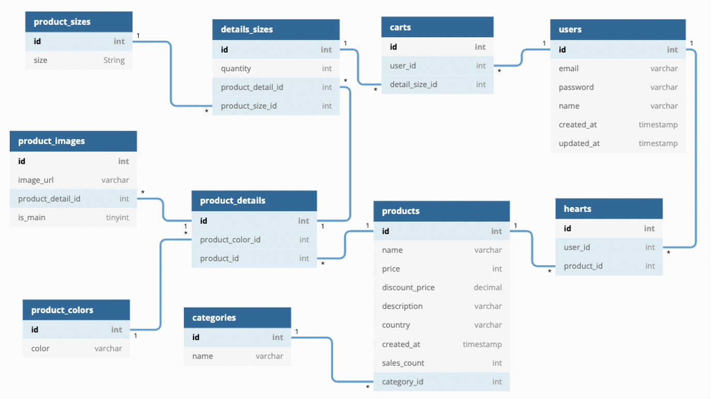

* content
{:toc}
장바구니 기능과 결제 기능을 구현해보았다.(실제로 결제가 되지는 않지만 결제의 과정을 한 번 구현해보았다.)


---



프로젝트 진행 도중 조금 수정된 모델링이다.

장바구니 API를 구현하기 위한 carts라는 테이블이 있다. product_details 테이블은 상품이름과 색상 정보를 가지고 있고, details_sizes 테이블은 상품이름, 색상, 사이즈 정보를 모두 가지고 있다. details_sizes 테이블과 users 테이블을 다대다 관계로 연결해주는 테이블이 carts 테이블이다.(이렇게 새로운 기능을 위해 테이블을 만든 경우에도 다대다 관계를 연결해주는 테이블이라고 하는게 맞는지 잘 모르겠다.)

---

# 문제

'details_sizes 테이블과 users 테이블만 잘 이어주면 장바구니 기능은 쉽게 만들겠지'라고 생각하며 장바구니 기능 구현을 프로젝트 마지막으로 미뤄두고 다른 작업부터 진행했다. 다른 작업들을 마치고 장바구니 기능을 구현하려고 디테일 페이지의 프론트/백을 맡은 팀원들과 회의를 진행하는데 문제가 발생했다. 디테일 페이지와 API가 데이터를 주고받는 형식이 내가 생각한 것과 너무 달랐기 때문이다.

장바구니 기능을 편하게 구현하기 위해서는 details_sizes 테이블을 이용해야했기 때문에 거기에 맞춰 다시 코드를 수정하고나서야 장바구니 기능을 구현할 수 있었다.

---

# 장바구니 API

프로젝트를 진행하면서 느낀점중 하나는 데이터베이스에서 최대한 줄 수 있는 정보를 모두 담아서 주는게 좋은 것 같다는 것이다. 물론 쓸데없는 정보가 많이 들어가면 성능에 좋지 않겠지만, 나 자신이 아직까지는 어떤 정보가 필요하고 필요없는지 정확하게 판단하지 못하는 것 같다. 처음 코드를 짤 때 최소한 합쳐진 데이터들의 id 값이라도 모두 넣어주는 것이 좋을 것 같다.

다음 코드는 프론트에서 이미 짜놓은 코드가 id를 사용하지 않고 id에 해당하는 사이즈 이름, 색상 이름 등을 사용하고 있어 다음과 같은 형태로 전달해주었다.

```js
// models/productDao.js

const putCart = async (userId, detailSizeId) => {
  await prisma.$queryRaw`
    INSERT INTO
      carts(user_id, detail_size_id)
    VALUES
      (${userId}, ${detailSizeId})
  `;

  return 1;
};

const getCartByUserId = async userId => {
  const list = await prisma.$queryRaw`
  SELECT
    carts.user_id AS userId,
    product_sizes.size AS size, 
    product_colors.color AS color,
    product_images.image_url AS imageUrl,
    products.name AS name,
    products.price AS price,
    products.discount_price AS discountPrice
  FROM
    carts
  JOIN
    details_sizes
  ON
    carts.detail_size_id = details_sizes.id
  JOIN
    product_sizes
  ON
    details_sizes.product_size_id = product_sizes.id
  JOIN
    product_details
  ON
    details_sizes.product_detail_id = product_details.id
  JOIN
    product_colors
  ON
    product_details.product_color_id = product_colors.id
  JOIN
    product_images
  ON
    product_details.id = product_images.product_detail_id
  JOIN
    products
  ON
    product_details.product_id = products.id
  WHERE
    carts.user_id=${userId}
  AND
    product_images.is_main=true;
  `;

  return list;
};

const deleteCart = async cartId => {
  await prisma.$queryRaw`
    DELETE FROM
      carts
    WHERE
      carts.id=${cartId}
  `;

  return 1;
};
```

deleteCart 같은 함수는 기능을 실행한 뒤에 어떤 값을 리턴해주지는 않는데, 이런 경우에 어떻게 return 값을 줘야할 지 모르겠다. 이것도 찾아봐야겠다.

---

# 결제 API

상품 랭킹 페이지가 이미 만들어져 있는데 원래 이 페이지는 프론트 기능 구현을 경험해보기 위해 구현 목록에 들어간 페이지라, 실제 데이터에 의해 동적으로 변경되게 만들 생각은 없었다. 페이지와 API를 만들다 보니 실제 데이터에 따라 변경되게 하고 싶어져서 products 테이블에 sales_count라는 컬럼을 추가하게 되었다.

이제 데이터에 따라 상품 랭킹 페이지가 변하게 되었긴 했지만, 결제 기능이 없었기 때문에 데이터베이스를 직접 수정하지 않으면 상품의 순위가 바뀌지 않았다. 그래서 결제 기능까지 추가하기로 했다.

이때까지 상품을 장바구니에 담거나 장바구니 목록에서 삭제하는 요청은 모두 GET 요청으로 구현했다. 토큰에서 userId를 받고, 쿼리 파라미터에 상품 id를 담았다. 결제는 장바구니에 있는 모든 상품을 한 번에 결제하는 방식으로 구현을 했기 때문에 POST 요청으로 구현해서 body에 모든 정보를 담아 보냈다.

```js
// services/productService.js

const checkOut = async cartList => {
  for (index in cartList) {
    await productDao.deleteCart(cartList[index].id);
    await productDao.updateDetailOnSize(cartList[index].detailOnSizeId);
    await productDao.updateSalesCount(cartList[index].productId);
  }

  return 1;
};
```

```js
// models/productDao.js

const deleteCart = async cartId => {
  await prisma.$queryRaw`
    DELETE FROM
      carts
    WHERE
      carts.id=${cartId}
  `;

  return 1;
};

const updateDetailOnSize = async detailOnSizeId => {
  await prisma.$queryRaw`
    UPDATE
      details_sizes
    SET
      quantity = quantity - 1
    WHERE
      details_sizes.id = ${detailOnSizeId};
  `;

  return 1;
};

const updateSalesCount = async productId => {
  await prisma.$queryRaw`
  UPDATE
    products
  SET
    sales_count = sales_count + 1
  WHERE
    products.id = ${productId}
  `;

  return 1;
};
```

CHECK OUT 버튼을 누르면 장바구니에 담긴 모든 상품의 정보가 서버로 넘어가고, 여러가지 작업이 동시에 일어난다.

먼저 장바구니에서 해당 데이터를 제거해주고, 재고를 차감한다. 그리고 판매량을 증가시킨다. 여기서 재고를 차감할때는 details_sizes 테이블을 이용하고, 판매량을 증가시킬 때는 products 테이블을 이용하는데, 재고는 상품의 색상, 사이즈에 따라 각각 달라야 하지만, 판매량은 한 제품의 모든 색상과 사이즈를 합쳐서 올리는게 맞다고 생각했기 때문이다.

---

# 느낀점

회원가입을 하고, 로그인을하고, 여러 상품을 장바구니에 담고 삭제한다. CHECK OUT 버튼을 누르면 장바구니에 들어있는 모든 상품들이 결제되어 재고가 줄어들고, 판매량이 증가한다. 그리고 이것은 각각의 페이지에 바로 반영이 되어 확인이 가능하다.

직접 테스트 해봤을때 구현한 모든 기능들이 잘 돌아가는 것을 보고 정말 기분이 좋았다.

하지만 아쉬운 점도 있었다. 내가 구현하지 않는 프론트/백엔드 코드도 함께 보며 리뷰하고 소통해야 한다는 것을 느꼈다. 내 생각과 전혀 다른 코드를 보니 잘 이해가 되지 않았고, 내가 생각한대로 구현할 수도 없었기 때문에 코드를 수정해야했고, 그만큼 시간이 부족해 자잘한 버그나 디테일을 수정하지 못한채 프로젝트를 끝내게 되었다. 물론 리팩토링은 할 생각이지만, 처음부터 소통을 잘 해왔더라면 더 좋은 결과물을 낼 수 있었을 것 같다는 생각에 아쉬움이 남았다.